# Introduction/Background
Housing price instability was an important cause of the 2007-2008 US recession[1]. Predicting property’s value to forecast such depressions was consequential thereafter. Some of the past works include regression techniques[2][3], and dimensionality reduction to improve house prediction model’s accuracy[4]. We are using the Ames Housing Dataset[5] which describes sales of individual housing properties in Ames, Iowa in 2006-2010. This dataset contains 2930 observations and 80 explanatory features such as property’s sale price, finish quality, construction, and remodeling year. It provides a comprehensive understanding of factors that influence housing price negotiations.

# Problem
The economy of a country is sensitive to the residential market. When the property prices increase, the owners spend more which in turn encourages construction and hence employment. However, during a recession, the prices decline which depress construction spending leading to a decline in employment. Thus, housing prices not only affect the buying/selling trends, but also can reflect current economic conditions. Using ML techniques, we aim to provide a predictive model to forecast the housing prices of a property and in turn predict the economic situation.

# Methods
Our strategy is to utilize a variety of supervised and unsupervised models to forecast home prices, and evaluate each one's performance using a set of measures (R-Square, Root Mean Square Error (RMSE), etc). We intend to progressively implement algorithms, evaluate the metrics, select the next model to employ and finally arrive at an optimized suitable model for house-price prediction.

## Data Collection
We are using the Ames Housing dataset compiled by Dean De Cock for use in data science education. It describes sales of individual housing properties in Ames, Iowa in 2006-2010. It contains 2930 observations with 80 explanatory features (37 numerical features and 43 categorical features). For our problem, we need not split the data into train and test splits as we already have the splitted dataset given to us.

## Data Cleaning
### Categorical Features
 For the categorical features with NAN values, we have replaced the cells with “None”. For instance, for the feature “Pool.Qc”, we have 2917 NAN values. Some non-NAN categorical values spanned [‘Ex’, ‘Gd’, ‘TA’, ‘Fa’] standing for Excellent, Good, Typical/Average, Fair respectively. Replacing NAN values with ‘None’ signifies the absence of the that feature.

  

### Numerical Features
For numerical features, we applied a suitable Nan replacement based on the data of each column. For example:
1. **Lot.Frontage** had 490 NAN values. This feature tells us the length of the linear street connected to the property. To properly estimate this feature, we used the Neighbourhood feature. Using this, we replace NAN values with the average value of all the Lot.Frontage for that datapoint’s neighbourhood. The neighborhoods GrnHill and LandMrk had many Lot.Frontage NANs. So we replaced the value for this feature to 0.
2. Similarly, **Garage.Yr.Blt** had 159 NAN values, which we replaced with None and Mas.Vnr.Area had 23 NAN values, which we replaced with 0 indicating it does not have area.
<!-- 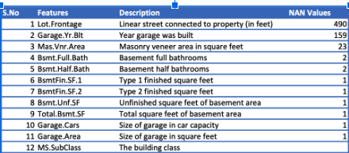 -->

  

## Exploratory Data Analysis
### Analysis of target variable: SalePrice
Our ML task is to predict the price of houses given a set of features. If our target variable is skewed towards a certain set of values or has a non-normal distribution, it will be difficult for the model to learn. Thus, it is important to evaluate the distribution of our target variable and take remedial steps if needed.

<!-- 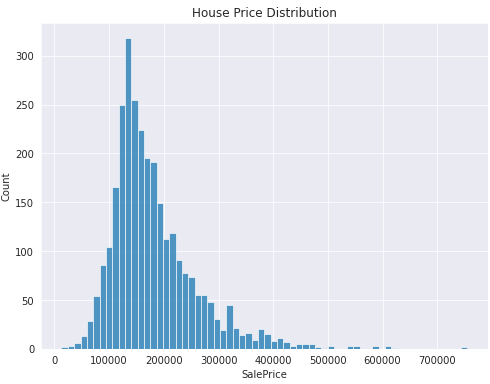 -->

  

For observing our SalePrice, we evaluate skewness and kurtosis. 
1. Skewness measures the asymmetry of a distribution. `SalePrice` has a skewness of `1.74` (i.e. > 1) which means that the distribution is heavily skewed to the right. It means that our target variable has a very asymmetric distribution.
2. Kurtosis on the other hand, measures the heaviness of a distribution's tails relative to a normal distribution. `SalePrice` has a kurtosis of `6.53` (i.e. >3) which means a large departure from normality.

### Analysis of numerical features
Next we wanted to evaluate numerical features. This is basically to identify which features our model can use which would help it to best predict the price of the house. We employed two different methods to identify which numerical features are highly connected with field SalePrice.

#### Correlation Function 
In this method we used sklearn’s correlation function. It gave us the top 10 features correlated with SalePrice. Some of these features included the overall quality, living area, garage area, number of full bathrooms, year built and the year in which the house was remodeled.

<!-- 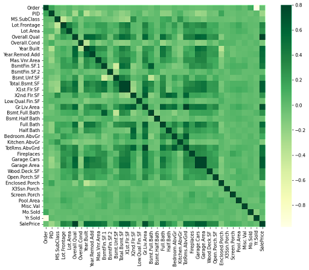 -->

  

#### Feature Elimination
In the second method we used sklearn’s recursive feature elimination method. It excludes the categorical variables and returns a list of top 10 features that were closely related with the SalePrice attribute.

According to both of our above analyses, the overall quality, living area, number of full baths, cars in the garage and the year of built are some of the most important features in determining the house price. 

<!-- 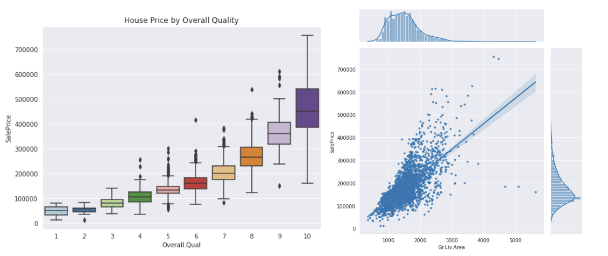 -->

  

As observed in the graphs above, the overall house quality and living area both have a direct relationship with the sale price. If one increases, so does the sale price.

#### Analysis of categorical variables (Examples):
**Neighborhood** influences the cost of the house. Areas like StoneBr, NoRidge are costly (median of $300K) while areas like BrDale and MeadowV are cheaper (median $100K). Similarly, The average price difference between a house with a good kitchen and one with excellent kitchen is about $120,000.

<!-- 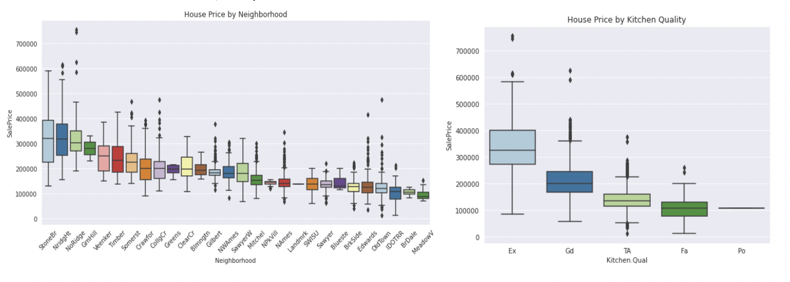 -->

  

#### Analyze correlated features
The correlation matrix also shows the presence of some features that are strongly correlated among themselves. Eg. GarageCars and GarageArea, GarageYearBuilt and the YrBuilt of the house. Since multicollinearity has a negative impact on our prediction models, we drop a feature that has a lower correlation with the sale price.

<!-- 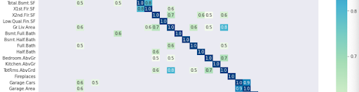 -->

  

## Feature Engineering
### Creating new variables
We create new features by logically combining few related weaker features in the training data. The new features we create are: TotSqFt, TotBaths, HouseAge, IsRemodeled.

### Label encoding
Label encoding converts labels into a numeric form. Some of the categorical features we encode are GarageCondition, PavedDrive, Utilities.

### Skewness and normalizing variables
Linear regression models assume normally distributed input data. This gives equal weight/importance to features and the penalty coefficients are the same for all the features. We use log transformation to fix our right-skewed data. We apply log transformation to SalePrice and other numerical variables.

<!-- 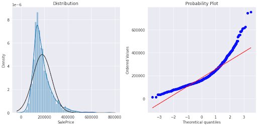 -->

  

### Feature scaling
Optimization methods and gradient descent converge faster on similarly scaled features. However, some models like Lasso and Elastic Net are very sensitive to outliers. We use RobustScaler to transform the training data.

# Supervised Learning Methods
**Linear Regression** fits a linear model with weights w = (w1, …, wp) to minimize the residual sum of squares between the observed targets in the dataset, and the targets predicted by the linear approximation.

**Ridge Regression** is a way to create a parsimonious model when the number of predictor variables in a set exceeds the number of observations, or when a data set has multicollinearity. The regularization used here is L2 regularization which penalizes sum of squares of parameters.

**Lasso Regression** is very similar to Ridge regression. The key difference in lasso as compared to ridge is that the penalty is applied to the sum of absolute values of theta (L1 regularization) and not to the sum of its square values. Lasso can shrink parameter values to absolute zero. Therefore, lasso can be used for feature selection as well.

## Model Evaluation
<!-- 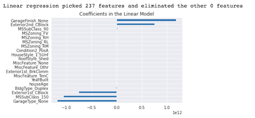 -->

  

<!-- 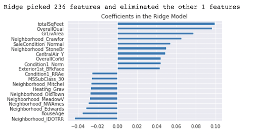 -->

  

<!-- 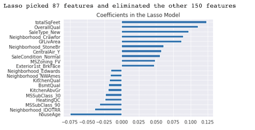 -->

  

## KFold cross validation
We used KFold cross validation where we divide the train set into K folds. For each fold, we train on data except the selected fold and evaluate the performance on the fold. This process is repeated for all the folds. We capture the average loss and scores for all the folds.

## Hyperparemeter Tuning
We tune the regularization parameter in both ridge and lasso. For calculating the best alpha, we train the model with a set of values and choose the value with the lowest mean loss. As we can observe in the graphs plotted between RMSE and regularization param, the loss first decreases as we increase the regularization strength and then starts increasing. A very high regularization doesn’t allow the model to fit the data properly and leads to underfitting. Therefore, after a threshold value of regularization strength, the model starts performing poorly with high error rates.

<!-- 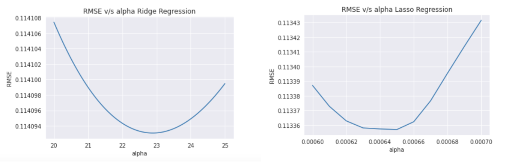 -->

  

## Model Performance
We use the Root Mean Square Error (RMSE) for evaluating the trained model on the test set. 

<!-- 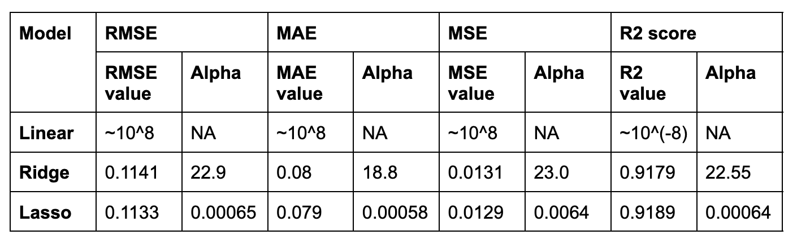 -->

  

## Result Analysis
For our regression task, we started by training linear, ridge and lasso regression models. Among these three, lasso performed the best. A simple non-regularized linear regression model performs very poorly and gives a very high loss value. Lasso and Ridge both perform much better than a simple non-regularized linear regression model. Lasso eliminates several features and thus is able to perform slightly better than even ridge-regression which eliminates only 1 feature. However, these are simplistic models and cannot usually work with complex datasets and features. Thus, to train a better regression model, we used advanced regression models like XGBRegressor, LGBMRegressor, Support Vector Regressor, Random Forest Regressor and ElasticNet.

We first trained our supervised regression on all the 288 available features. The table below captures different  metrics that we used to evaluate our models Mean Average Error (MAE), Mean Square Error (MSE), Root Mean Square Error (RMSE), R2 score, and the cross validation RMSE.

The results obtained when all the 288 features were used are as follows:

  

We knew that while using all the features for the model is a good start, it is not ideal. Feature selection has known benefits of reducing overfitting and improving accuracy while also leading to shortened training times. Thus, we explored two techniques to perform feature selection: GridSearchCV and selectingKBest based on features’ mutual information. 

  

Upon performing these two techniques, we were able to eliminate 108 features (~38%) from the model.  We re-trained and evaluated all our models with the reduced selected feature set. The results obtained when 180 selected features were used are as follows:

  

We observed that not only did the training times reduce significantly, our metrics of model evaluation also improved across the board.

# Unsupervised Learning Methods
On applying dimensionality reduction algorithm (PCA) on the scaled and encoded data, we reduce the number of features to 51 instead of 288. We removed the redundant features which were highly correlated with at least one other feature based on the correlation matrix obtained. We preserve 90% of variance with 51 features. For the first experiment, we applied hierarchical clustering and K means clustering on all the features. 

  

## Results and Discussions
The metrics obtained for K-Means clustering using all the features:
MAE: 0.21582002599324188
MSE: 0.08856944957030345
RMSE: 0.2976061988102792
R2 Score: 0.3117824783201255

The metrics obtained for Hierarchical clustering using all the features:
MAE: 0.22224744503045712
MSE: 0.09222645673704193
RMSE: 0.3036880912005637
R2 Score: 0.2833661742641709

  

As observed in silhouette scores, clustering isn't ideal with such a dataset with so many dimensions, even after dimensionality reduction using PCA. Though the MAE is less, the sale price predicted is done by calculating the mean of the cluster and using the same mean sale price value for all the unknown houses belonging to the same cluster. Hence, clustering might give some approximate values for a regression problem, but is not ideal as the same cluster mean/median is not applicable for all houses in the same cluster (or all houses that are similar to each other).

Instead we can use clustering to group similar houses and visualize how simple parameters affect cluster formation. 

Let us try to answer the question : **Can the Ames Housing data be clustered based on living area?**
Using K-Means clustering, we were able to cluster the data based on living area and the sale price. We grouped the data into 5 clusters.

  

Let us try to answer the question : **Can the Ames Housing data be clustered based on first floor lot area?**
Using Hierarchical clustering, we were able to cluster the data based on lot area and the sale price.

  

We choose the number of clusters to be 3. We cut the dendrogram so that we obtain 3 clusters as follows.

  

As clustering groups similar houses together, it would be a great method to recommend houses to prospective buyers. As a result, we devised a recommender system which recommends similar houses based on the type of apartment the user is interested in.

# Content Based Recommendation System

This algorithm is used to compute similarities between apartments based on all the features selected by the PCA. The main idea is to recommend apartments based on the apartment characteristics that the user has shown interest in (taken as an input).

To get similar apartments, we take the k-nearest neighbors approach. We first find the cosine matrix to find the similarities between the apartments. Given the input apartment features that the user is interested in, we find the k most similar apartments for the input apartment from the cosine matrix. 

Some examples of the recommendations based on overview :
## Example 1 
Input : The apartment the user showed interest in

  

Output:

  

## Example 2
Input : The apartment the user showed interest in

  

Output :

  

As observed from the examples, the recommendations that the algorithm gives are very similar to the apartment that the user has shown interest in. The algorithm performs really well for recommendations.

# References
1.  Congressional Research Service: Introduction to U.S. Economy: Housing Market- https://sgp.fas.org/crs/misc/IF11327.pdf. 2021 May 3
2.  P. Durganjali and M. V. Pujitha, "House Resale Price Prediction Using Classification Algorithms," 2019 International Conference on Smart Structures and Systems (ICSSS), 2019, pp. 1-4
3.  V. S. Rana, J. Mondal, A. Sharma and I. Kashyap, "House Price Prediction Using Optimal Regression Techniques," 2020 2nd International Conference on Advances in Computing, Communication Control and Networking (ICACCCN), 2020, pp. 203-208
4.  S. B. Sakri and Z. Ali, "Analysis of the Dimensionality Issues in House Price Forecasting Modeling," 2022 Fifth International Conference of Women in Data Science at Prince Sultan University (WiDS PSU), 2022, pp. 13-19
5.  De Cock D. Ames, Iowa: Alternative to the Boston housing data as an end of semester regression project. Journal of Statistics Education. 2011 Nov 1;19(3)
6.  Lee, Anthony J.T.; Lin, Ming-Chih; Kao, Rung-Tai; and Chen, Kuo-Tay, "An Effective Clustering Approach to Stock Market Prediction" (2010). PACIS 2010 Proceedings. 54.

# Contribution (After Midterm Report)
| Process                           | Name      |
|:----------------------------------|:----------|
|Supervised Learning Impl           | Anirudh   |
|Supervised Learning Analysis       | Dhruv     |
|Unsupervised Learning              | Shruti    |
|Presentation                       | Aayushi   |
|Video                              | Navdha    |
|GitHub Page                        | Aayushi, Navdha    |    
